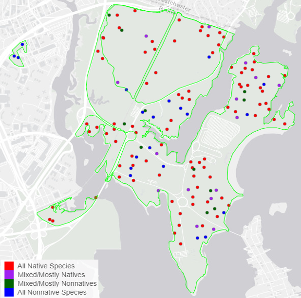
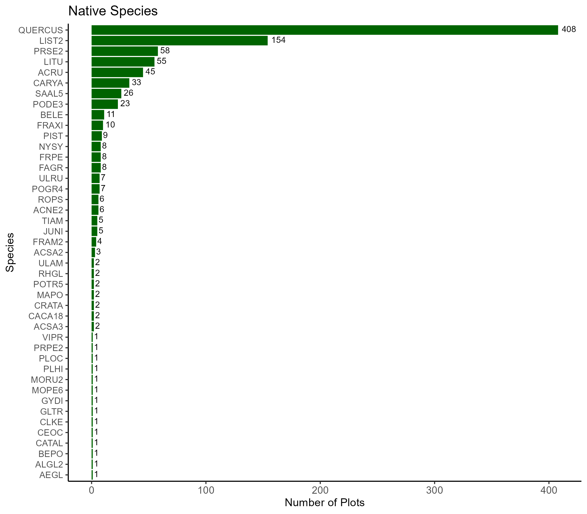
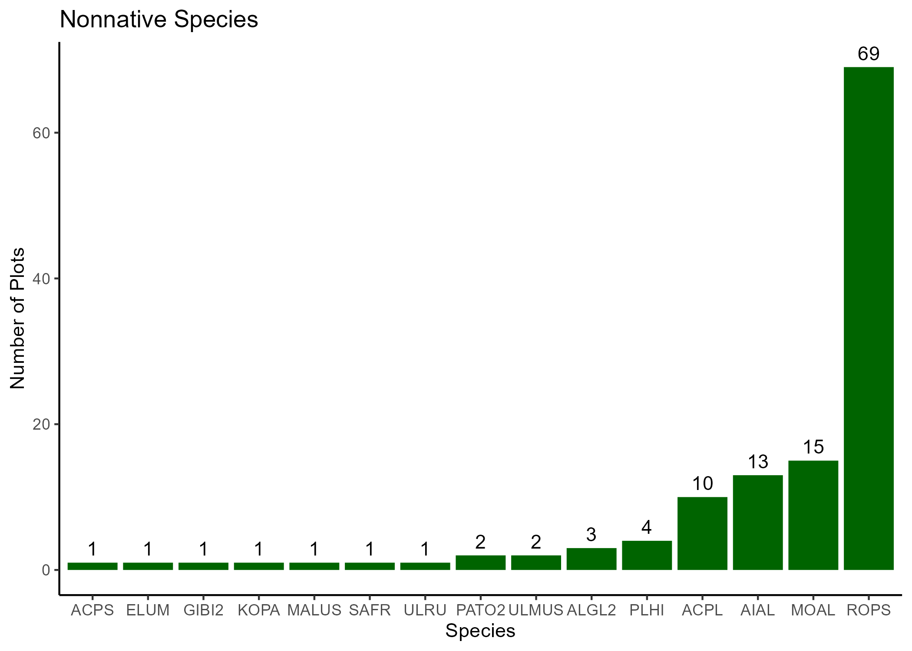
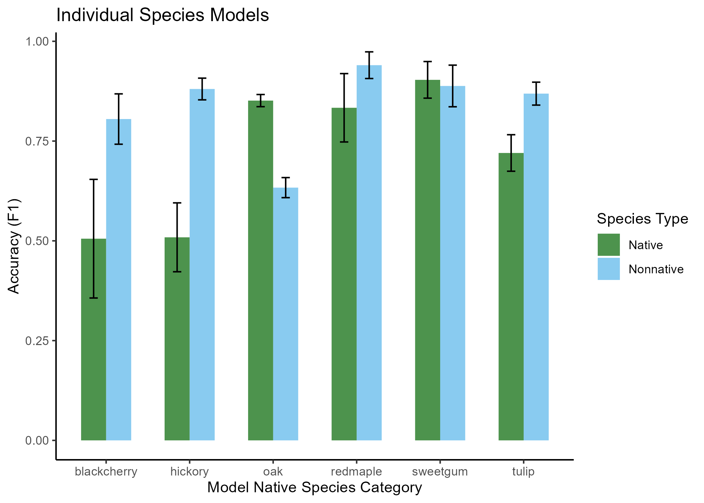
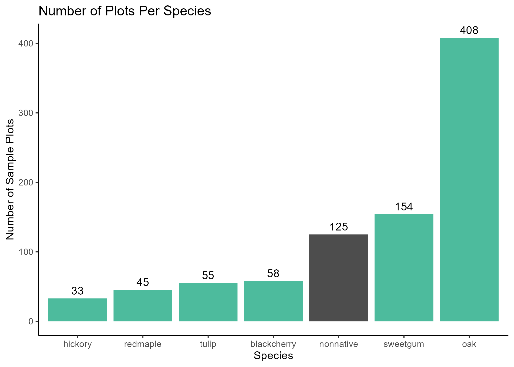
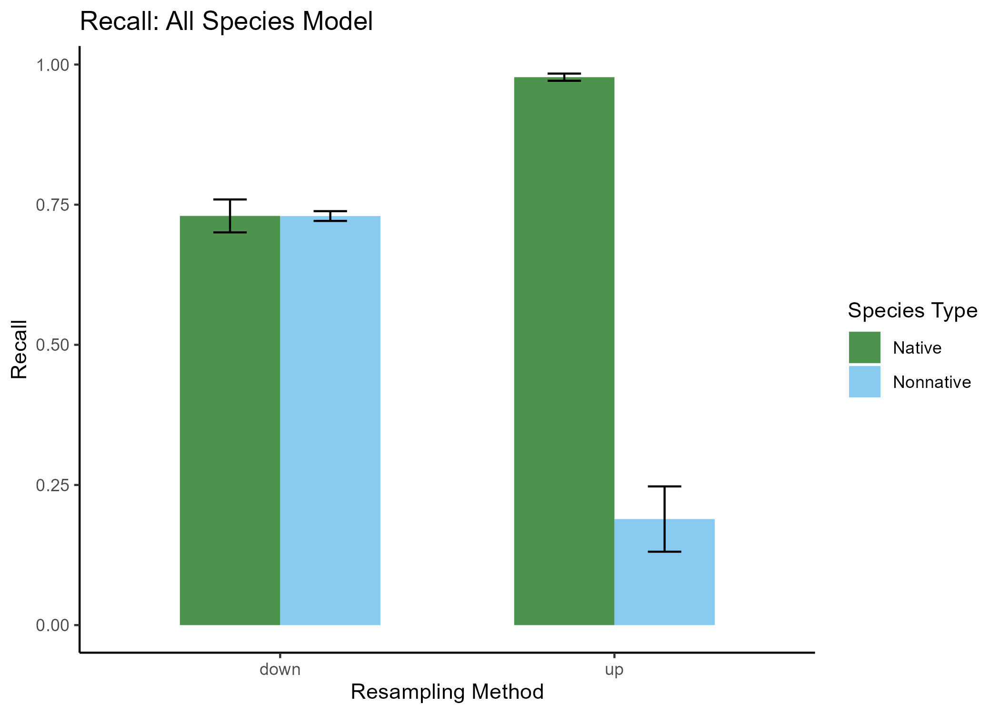
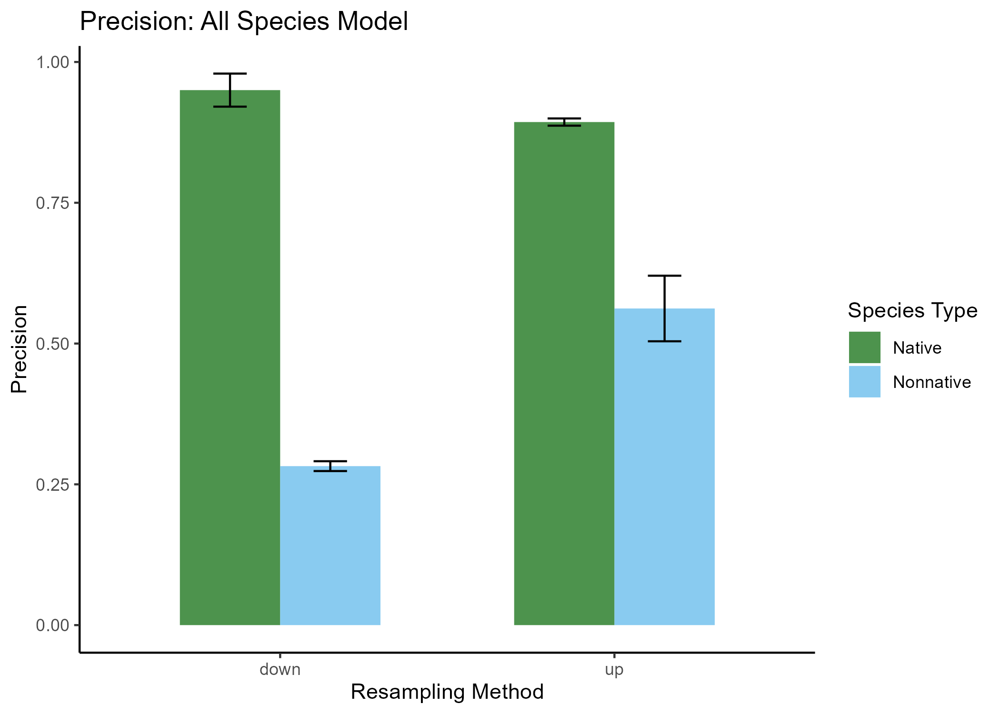
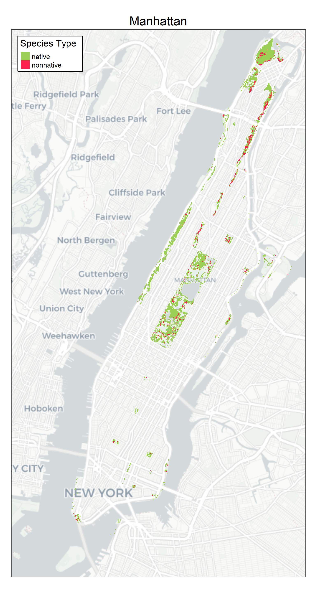
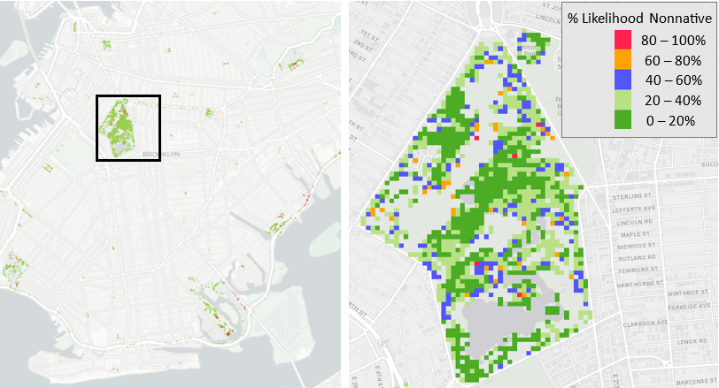
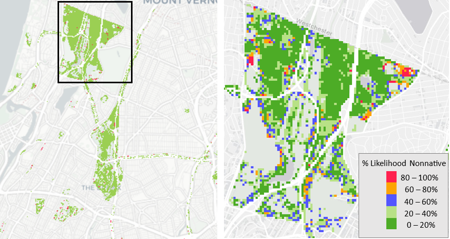

## A Phenology-Based Method of Locating Nonnative Tree Species in NYC
 
 I explored using phenology metrics derived from satellite data to parse native and nonnative tree species in New York City. In the temperate climate of the northeastern US, most of our tree species are deciduous. Nonnative species tend to follow a phenological cycle that is distinct from native species, leafing out earlier in the spring and losing their leaves later in the fall. Phenological signals could potentially be used to distinguish between these two types of tree species. 

### Data

* Natural Areas Conservancy tree species data: Collected through field survey methods, this dataset identifies the dominant tree species (calculated by proportion of basal area in each plot) in 1,052 plots in forested areas throughout New York City. 
* Of these plots, 927 are dominated by a native species and 125 by a nonnative species (see charts below).
* Satellite data: The 30m resolution Harmonzed Landsat/Sentinel-2 data product was accessed using NASA's Earth Data API. For code used to access and process satellite data, see [this notebook](./R/phenology_metrics.Rmd)
* Vector data: shapefiles of New York City's parks and boroughs were used to crop the raster data.

Sample plots in Pelham Bay Park, one of the forested areas represented in the dataset             |  
:-------------------------:|

Number of Plots for Each Native Species             |  
:-------------------------:|
  

Number of Plots for Each Nonnative Species          |
:-------------------------:|

### Methods

I trained a series of random forest models to classify forested pixels as either native or nonnative, using individual native species as the native category. Next, I trained a model that used all 43 different native species in the dataset as the native category. My code for this process can be found [here](./R/train_random_forest_models.Rmd)

To train each model, data were split into training (70%) and testing (30%) subsets. Each model was trained and tested using 10-fold cross-validation. Resampling was conducted within cross-validation using either up-sampling or down-sampling to try and mitigate class imbalance in the training data. 

Each model was trained and tested five times and the mean accuracy metrics were recorded. Precision, recall, and F1 were the metrics I used to assess the models' performance. 

I used the same set of 40 variables derived from 30m resolution satellite data to train each model. The variables were made up of spectral bands from spring and fall, as well as phenology metrics extracted from a growing season time series of TDVI (a measure of vegetation greenness). For the code used to derive the phenology metrics, see [this notebook](./R/phenology_metrics.Rmd).

Finally, I [used the all-species model](./R/classify_nonnative_species_nyc.Rmd) to produce maps predicting the locations of nonnative species throughout the city's forested areas. 

### Results 

*Single Species Models*

The highest performing individual species models were the Sweetgum and Red Maple models, which achieved high F1 scores for both native and nonnative categories.

The severe class imbalance in the Black Cherry and Hickory models may have impeded training. However, the Red Maple model and Tulip Tree model show that, even with highly imbalanced data, phenological information can successfully differentiate these species. 

F1 for individual species: Back Cherry, Hickory, Oak, Red Maple, Sweetgum and Tulip Tree          |
:-------------------------:|

Number of plots available for each species          |
:-------------------------:|

*All-species Model*

The all-species model had a highly imbalanced training data (927 native vs. 125 nonnative samples). Using resampling techniques, the model can be optimized to maximize either precision or recall, depending on the priorities of the end user.

Recall shows the percentage of pixels in each category correctly identified by the model. The down-sampled model performs better in this task, correctly identifying about 75% of total pixels in each category. The up-sampled model was able to identify less than 25% of nonnative pixels.

Recall for all-species model using down-sampling (right) or up-sampling (left)      |
:-------------------------:|

Precision shows how many predictions in each category were correct.  In this case, the up-sampled model performs better, with 60% of nonnative predictions and 90% of native predictions being correct. 

Precision for all-species model using down-sampling (right) or up-sampling (left)      |
:-------------------------:|

*Maps*

This map of Manhattan was produced using the up-sampled all-species model predictions for all pixels with greater than 60% tree canopy. This model is known to predict nonnative pixels with ~60% accuracy, but to identify ~25% of total nonnative pixels present. These maps therefore present a conservative estimate of the presence of nonnatives, but we can be fairly confident that those identified are accurate.

These inset maps of Prospect Park in Brooklyn and Van Cortland Park in the Bronx show the probability that each pixel belongs to the nonnative class. For reference, the binary native/nonnative maps of the borough is included on the left. Both maps are produced using the up-sampled model.

<b>Prospect Park</b>

<b>Van Cortland Park</b>

### Conclusion

While phenological information can be sufficient to parse native from nonnative species, the severely imbalanced nature of the available data impedes the training process. Acquiring a higher number of nonnative samples would allow for a fuller assessment of this method’s potential.  However, the success of the high performing models shows that a combination of clear phenological separation between classes, adequate sample size, and resampling strategy can produce useful guidance for forest managers seeking to estimate the presence of invasive species. 